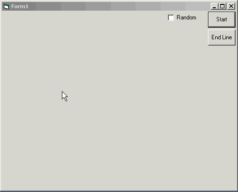



## Fractal Shapes Composer

### Description

Fractal Shapes Composer was my "Computer Graphics" project in IUST University. It generates fractal shapes in 2 methods
 
### More Info
 

             |
---                |---
**Submitted On**   |2004-10-03 21:42:00
**By**             |[Omid G\.L\.](https://github.com/Planet-Source-Code/PSCIndex/blob/master/ByAuthor/omid-g-l.md)
**Level**          |Intermediate
**User Rating**    |4.8 (24 globes from 5 users)
**Compatibility**  |VB 5\.0, VB 6\.0
**Category**       |[Graphics](https://github.com/Planet-Source-Code/PSCIndex/blob/master/ByCategory/graphics__1-46.md)
**World**          |[Visual Basic](https://github.com/Planet-Source-Code/PSCIndex/blob/master/ByWorld/visual-basic.md)
**Archive File**   |[Fractal\_Sh1800341042004\.zip](https://github.com/Planet-Source-Code/omid-g-l-fractal-shapes-composer__1-56475/archive/master.zip)

